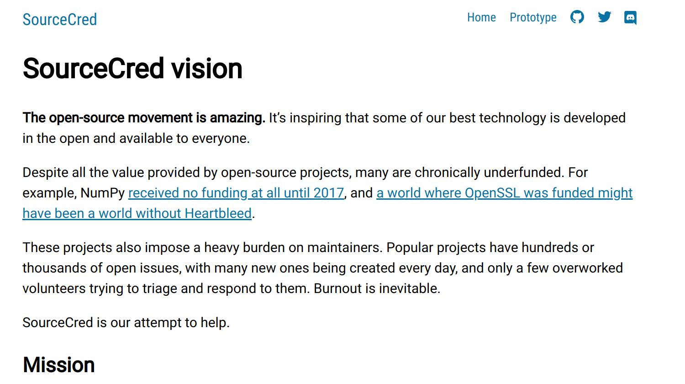
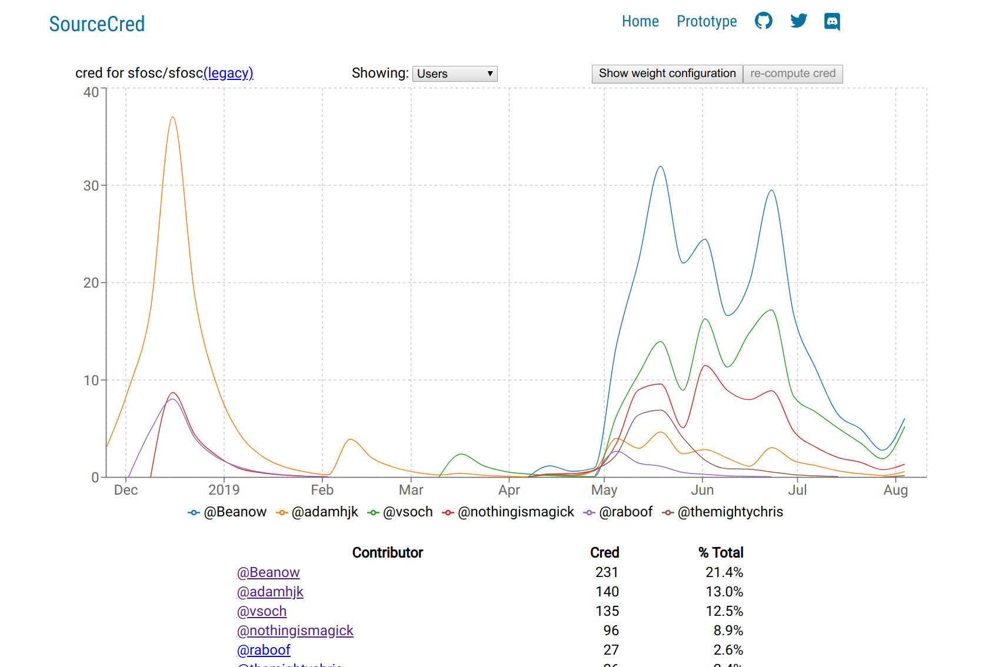

# [SourceCred](https://sourcecred.io)

[](https://circleci.com/gh/sourcecred/sourcecred)
[](https://discourse.sourcecred.io)
[](https://discord.gg/tsBTgc9)
[](https://greenkeeper.io/)

SourceCred creates reputation networks for open-source projects.
Any open-source project can create its own _cred_, which is a reputational metric showing how much credit contributors deserve for helping the project.
To compute cred, we organize a project’s contributions into a graph, whose edges connect contributions to each other and to contributors.
We then run PageRank on that graph.

To learn more about SourceCred’s vision and values, please check out [our website] and our [forum].
One good forum post to start with is [A Gentle Introduction to Cred].

For an example of SourceCred in action, you can see SourceCred’s own [prototype cred attribution][prototype].

[our website]: https://sourcecred.io/
[prototype]: https://sourcecred.io/cred/timeline/@sourcecred/
[A Gentle Introduction to Cred]: https://discourse.sourcecred.io/t/a-gentle-introduction-to-cred/20

## Current Status

We have a [prototype] that can generate a cred attribution based on GitHub interactions (issues, pull requests, comments, references, etc.).
We’re working on adding more information to the prototype, such as tracking modifications to individual files, source-code analysis, GitHub reactions, and more.

### Running the Prototype

If you’d like to try it out, you can run a local copy of SourceCred as follows.
First, make sure that you have the following dependencies:

  - Install [Node] (tested on v12.x.x and v10.x.x).
  - Install [Yarn] (tested on v1.7.0).
  - Create a [GitHub API token]. No special permissions are required.
  - For macOS users: Ensure that your environment provides GNU
    coreutils. [See this comment for details about what, how, and
    why.][macos-gnu]

[Node]: https://nodejs.org/en/
[Yarn]: https://yarnpkg.com/lang/en/
[GitHub API token]: https://github.com/settings/tokens
[macos-gnu]: https://github.com/sourcecred/sourcecred/issues/698#issuecomment-417202213

You'll still need to create a GitHub token to use as an environment variable (shown later). First, run the following commands to clone and build SourceCred:

```Bash
git clone https://github.com/sourcecred/sourcecred.git
cd sourcecred
yarn install
yarn backend
export SOURCECRED_GITHUB_TOKEN=YOUR_GITHUB_TOKEN
node bin/sourcecred.js load REPO_OWNER/REPO_NAME
```

Loading a repo can take a few minutes. When it is finished, it will exit. Next, we can start sourcecred:

```Bash
yarn start
```

Finally, we can navigate a browser window to `localhost:8080` to view generated data.

### Loading a Discourse Server

SourceCred can also run on Discourse instances!

Prepare SourceCred using the same steps as above, then use the `sourcecred discourse` command,
providing the server url. Below is an example for loading the cred for SourceCred's [own discourse instance][forum].

```Bash
git clone https://github.com/sourcecred/sourcecred.git
cd sourcecred
yarn install
yarn backend
node bin/sourcecred.js discourse https://discourse.sourcecred.io
```

### Running with Docker

You can build and run sourcecred in a container to avoid installing dependencies on your host. First, build the container:

```bash
$ docker build -t sourcecred/sourcecred .
```

If you want to build and customize the `SOURCECRED_DIRECTORY`, you can set that as a `--build-arg`:

```bash
$ docker build --build-arg SOURCECRED_DEFAULT_DIRECTORY=/tmp/data \
  -t sourcecred/sourcecred .
```

Your options for running the container including the following commands.
Examples will be shown for each.

 - **dev-preview**: offers a shortcut for loading sourcecred and then starting a dev server. This is likely the option you'll choose if you want to provide a respository or an organization and preview results a web interface.
 - **dev-server**: exposes several webpack operations without the initial load. This takes no arguments.
 - **build**: simply provides the build command to yarn, followed by any argumnents that you provide.
 - **(anything else)**: will be passed on to sourcecred.js

#### Development Preview

To run the development preview, you will still need to export a GitHub token, and then provide it to the container when you run it.
Notice that we are also binding port 8080 so we can view the web interface that will be opened up.
The only argument needed is a command to load the GitHub repository to generate the sourcecred for:

```bash
REPOSITORY=sfosc/sfosc
$ SOURCECRED_GITHUB_TOKEN="xxxxxxxxxxxxxxxxx" \
  docker run -d --name sourcecred --rm --env SOURCECRED_GITHUB_TOKEN \
  -p 8080:8080 sourcecred/sourcecred dev-preview "${REPOSITORY}"
```

You can also specify an entire organization:

```bash
ORGANIZATION=@sfosc
$ SOURCECRED_GITHUB_TOKEN="xxxxxxxxxxxxxxxxx" \
  docker run -d --name sourcecred --rm --env SOURCECRED_GITHUB_TOKEN \
  -p 8080:8080 sourcecred/sourcecred dev-preview "${ORGANIZATION}"
```

If you want to bind the data folder to the host, you can do that too.
In the example below, we have a folder "data" in the present working directory that we bind to "/data" in the container, the default `SOURCECRED_DIRECTORY`. We can then generate the data (and it will
be saved there):

```bash
$ SOURCECRED_GITHUB_TOKEN="xxxxxxxxxxxxxxxxx" \
  docker run -ti --name sourcecred --rm --env SOURCECRED_GITHUB_TOKEN \
  -v $PWD/data:/data sourcecred/sourcecred load "${REPOSITORY}"
```

Notice that we don't need to bind the port because no web server is run.

As the command runs, you will see a progress output like this:

```bash
  GO   load-sfosc/sfosc
  GO   github/sfosc/sfosc
 DONE  github/sfosc/sfosc: 25s
  GO   compute-cred
 DONE  compute-cred: 1s
 DONE  load-sfosc/sfosc: 26s
...
```

The container will finish, and you can see the data generated in "data":

```bash
$ tree data/
data/
├── cache
│   └── mirror_4d4445774f6c4a6c6347397a61585276636e6b784f544d784d5441784e44593d.db
└── projects
    └── QHNmb3Nj
        ├── cred.json
        ├── weightedGraph.json
        └── project.json
```

Once the command has completed, you can locally explore the data by using the `dev-server` command.
Since we've already generated the data, we no longer need the GitHub token.

```bash
$ docker run -d --name sourcecred --rm -p 8080:8080 -v $PWD/data:/data \
  sourcecred/sourcecred dev-server
```

We are running in detached mode (-d) so it's easier to remove the container after.
It will take about 30 seconds to do the initial build, and when the web server is running you'll see this at the end:

```bash
$ docker logs sourcecred
...
[./node_modules/react/index.js] 190 bytes {main} {ssr} [built]
[./src/homepage/index.js] 1.37 KiB {main} [built]
[./src/homepage/server.js] 5.61 KiB {ssr} [built]
    + 1006 hidden modules
ℹ ｢wdm｣: Compiled successfully.
```

**Important** Although we expose port 0.0.0.0 to be viewable on your host, this is _not a production_ deployment and you should take precaution in how you use it.
Then you can open up to [http://127.0.0.1:8080](http://127.0.0.1:8080) to see the interface!



You can click on "prototype" to see a list of repositories that you generated (we just did sfosc/sfosc):


And then finally, click on the repository name to see the graph.



When you are finished, stop and remove the container.

```bash
$ docker stop sourcecred
```

Since we used the remove (--rm) tag, stopping it will also remove it.
If you bound the data folder to the host, you'll see the output remaining there from the generation:

```bash
$ tree data/
data/
├── cache
│   └── mirror_4d4445774f6c4a6c6347397a61585276636e6b784e546b344f44677a4f54453d.db
└── projects
    └── c2Zvc2Mvc2Zvc2M
        ├── cred.json
        ├── weightedGraph.json
        └── project.json

3 directories, 4 files
```

Cool!


#### Development Server

The development server lets you explore a populated sourcecred data directory using a local server.
After you've loaded data into your directory, you can run the container like this:

```bash
$ docker run -d --name sourcecred --rm -p 8080:8080 -v $PWD/data:/data \
  sourcecred/sourcecred dev-server
```

That will start the server without load or generation first:

```bash
$ docker logs sourcecred
(node:17) DeprecationWarning: Tapable.plugin is deprecated. Use new API on `.hooks` instead
ℹ ｢wds｣: Project is running at http://0.0.0.0:8080/webpack-dev-server/
ℹ ｢wds｣: webpack output is served from /
ℹ ｢wds｣: Content not from webpack is served from /code
```

When you finish, don't forget to stop the container:

```bash
$ docker stop sourcecred
```

_Note: this is intended for development and local previews, it is not secure to host in production._


#### Build

Build is used to generate static webpage files when you're ready to publish your sourcecred data.
In the example below, we issue a build command for pre-generated files in "data" and specify output with `--output-path <path>` to be another volume.

```bash
$ docker run -d --name sourcecred --rm -v $PWD/data:/data -v $PWD/docs:/output \
  sourcecred/sourcecred build --output-path /output
```

The container will run again for about 30 seconds, you can run `docker logs sourcecred` to see output.
When the container no longer exists, you can look in "docs" in the present working directory to see output files:

```bash
$ ls docs/
asset-manifest.json  discord-invite  favicon.png  index.html  prototype  static  test  timeline
```

This is the same content that we saw earlier with the development server, so a reasonable use case for this command would be to run to build docs that you then serve statically.

#### Wildcard

If your command doesn't start with one of build, dev-server, or dev-preview, it will just be passed on to the sourcecred.js. For example, here we can ask for a version or help:

```bash
$ docker run -it --name sourcecred --rm  sourcecred/sourcecred --version
sourcecred v0.4.0
```

or for help:

```bash
$ docker run -it --name sourcecred --rm  sourcecred --help
usage: sourcecred COMMAND [ARGS...]
       sourcecred [--version] [--help]

Commands:
  load          load repository data into SourceCred
  clear         clear SoucrceCred data
  help          show this help message

Use 'sourcecred help COMMAND' for help about an individual command.
```

#### Examples

If you wanted to look at cred for [ipfs/js-ipfs], you could run:

```Bash
export SOURCECRED_GITHUB_TOKEN=YOUR_GITHUB_TOKEN
node bin/sourcecred.js load ipfs/js-ipfs
```

[ipfs/js-ipfs]: https://github.com/ipfs/js-ipfs

You can also combine data from multiple repositories into a single graph.
To do so, pass multiple repositories to the `load` command, and specify an “output name” for the repository.
For instance, the invocation

```Bash
node bin/sourcecred.js load ipfs/js-ipfs ipfs/go-ipfs --output ipfs/meta-ipfs
```

will create a graph called `ipfs/meta-ipfs` in the cred explorer, containing the combined contents of the js-ipfs and go-ipfs repositories.

## Early Adopters

We’re looking for projects who want to be early adopters of SourceCred!
If you’re a maintainer of an open-source project and would like to start using SourceCred, please reach out to us on our [Discord] or our [forum].

## Contributing

We’d love to accept your contributions!
You can reach out to us by posting on our [forum], or chatting with us on [Discord].
We'd be happy to help you get started and show you around the codebase.
Please also take a look at our [contributing guide].

If you’re looking for a place to start, we’ve tagged some [good first issues].

[forum]: https://discourse.sourcecred.io/
[Discord]: https://discord.gg/tsBTgc9
[contributing guide]: https://github.com/sourcecred/sourcecred/blob/master/CONTRIBUTING.md
[good first issues]: https://github.com/sourcecred/sourcecred/issues?q=is%3Aissue+is%3Aopen+label%3A%22good+first+issue%22

## License

SourceCred is dual-licensed under Apache 2.0 and MIT terms:

  * Apache License, Version 2.0, ([LICENSE-APACHE](LICENSE-APACHE) or <https://www.apache.org/licenses/LICENSE-2.0>)
  * MIT License ([LICENSE-MIT](LICENSE-MIT) or <https://opensource.org/licenses/MIT>)

## Acknowledgements

We’d like to thank [Protocol Labs] for funding and support of SourceCred.
We’d also like to thank the many open-source communities that produced the software that SourceCred is built on top of, such as [Git] and [Node][Node github].

[Protocol Labs]: https://protocol.ai
[Git]: https://github.com/git/git
[Node github]: https://github.com/nodejs/node
